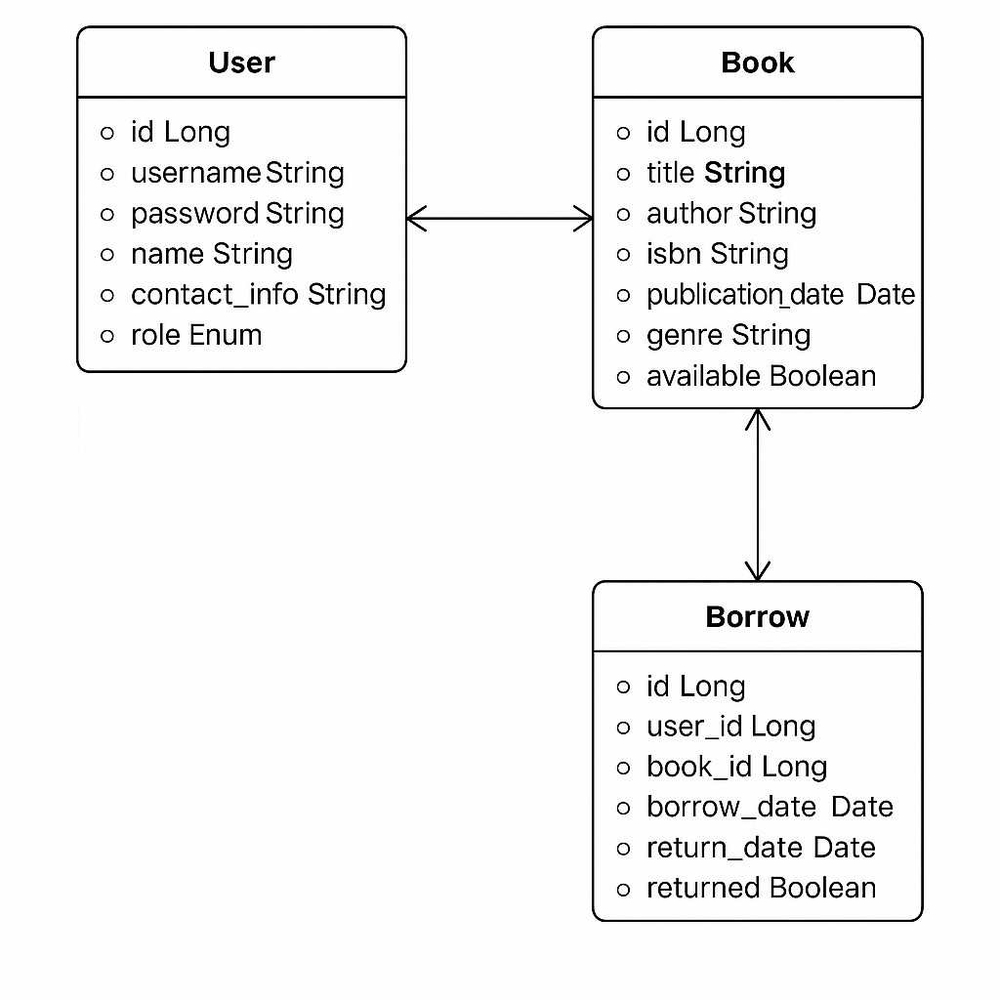
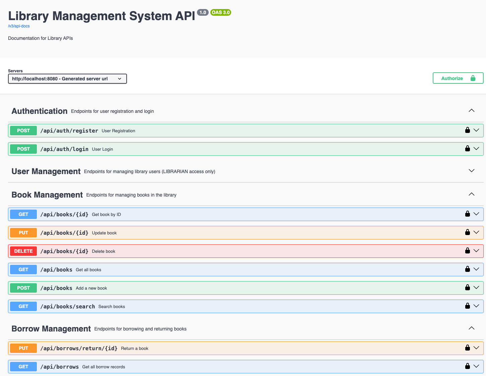
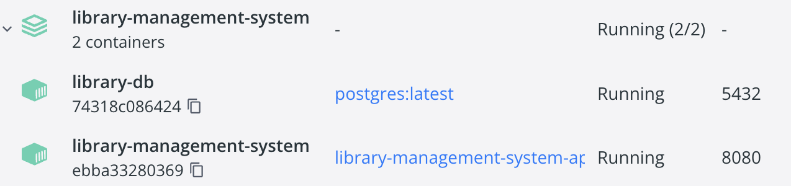
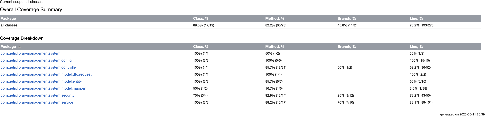

# 📚 Library Management System

A modern, full-featured library management system developed as part of the Getir Java Spring Boot Bootcamp graduation project.

## 🚀 Project Overview

This application enables:

- 📖 Book management (add, update, delete, search)
- 👤 User registration and authentication with JWT
- 📚 Borrowing and returning books with role-based access (Librarian & Patron)
- ⏰ Overdue reporting
- 🔔 Real-time book availability updates using **Spring WebFlux**
- 📑 Swagger UI for API documentation
- 🐳 Docker support for containerized deployment

## 🛠️ Tech Stack

| Layer                  | Technology                     |
|------------------------|--------------------------------|
| Backend Framework      | Spring Boot (Java 21)          |
| Reactive Programming   | Spring WebFlux + Reactor       |
| API Documentation      | SpringDoc OpenAPI + Swagger UI |
| Authentication         | Spring Security + JWT          |
| Database               | PostgreSQL + H2                |
| Build Tool             | Gradle                         |
| Containerization       | Docker + Docker Compose        |
| Logging                | SLF4J + Logback                |
| Testing                | JUnit 5 + Spring Boot Test     |

## 🧑‍💻 Running the Project Locally

### 🔧 Prerequisites

- Java 21+
- Gradle 8+
- Docker & Docker Compose (optional but recommended)
- PostgreSQL (if not using Docker)

---

### 🏃 Run without Docker

```bash
./gradlew bootRun
```
*application.yml* should contains the correct PostgreSQL connection info:

```yaml
spring:
  datasource:
    url: jdbc:postgresql://localhost:5432/library_db
    username: postgres
    password: postgres
  jpa:
    hibernate:
      ddl-auto: update
```

## 🐳 Run with Docker (Recommended)

**Build the image:**
```bash
docker build -t library-management-system .
```
**Start services:**

```bash
docker-compose up
```
Application will be available at: http://localhost:8080

## 🔗 API Documentation

You can explore all endpoints interactively via Swagger UI:

📍 http://localhost:8080/swagger-ui/index.html

The API endpoints are grouped logically by functionality and include detailed request/response examples.

## Database Schema


**Entities:**

User — id, username, password, name, contactInfo, role

Book — id, title, author, isbn (unique), publicationDate, genre, available

Borrow — id, user_id, book_id, borrowDate, returnDate, returned

## 📦 Postman Collection
A complete Postman Collection is included:

- 🗂️ Grouped by features

- ✅ Includes example requests/responses

- 🔐 JWT Bearer authentication support

## 📎 Additional Notes
- Logback is used to log all key application events (console & file).

- Test coverage includes both unit and integration tests.

- Reactive stream is available at /api/stream/books to listen for availability updates in real-time.

- Docker volumes persist PostgreSQL data between runs.

## 📸 Screenshots



## Author
**Buğra Bilge Çelik**

Getir Java Spring Boot Bootcamp – Graduation Project
